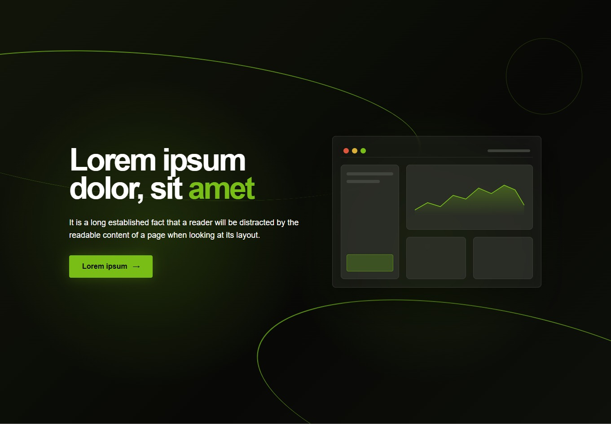
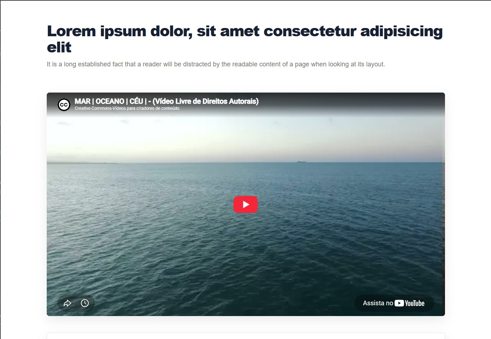
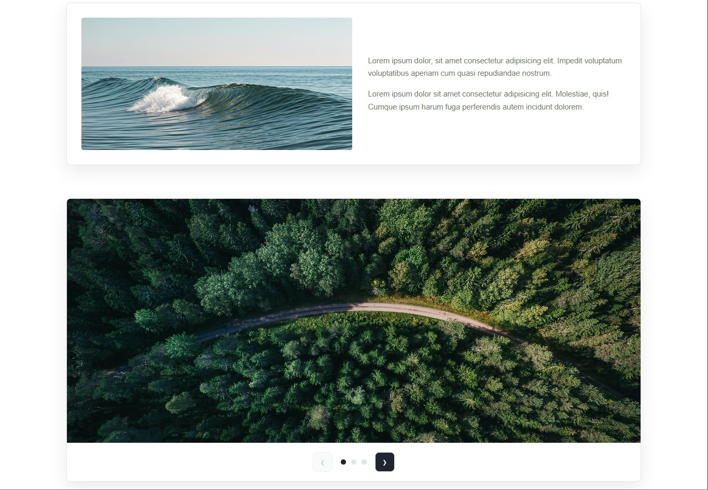
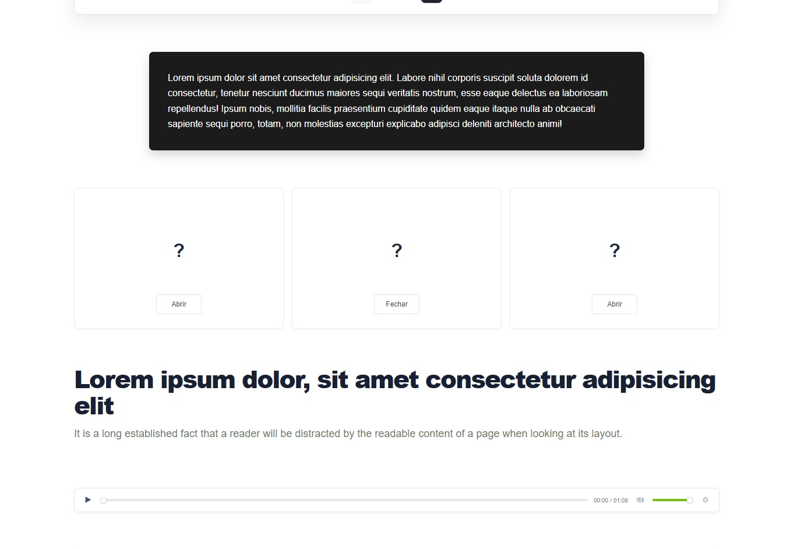
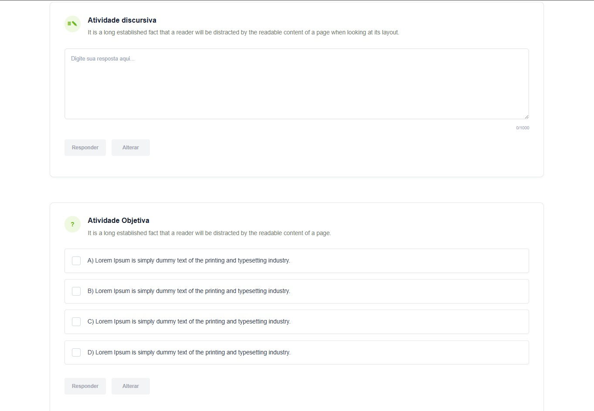
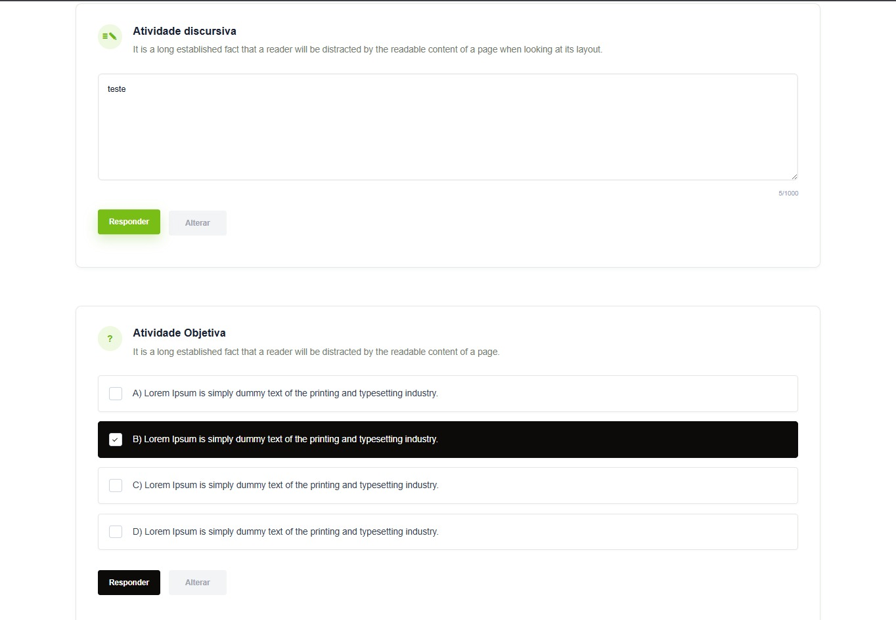
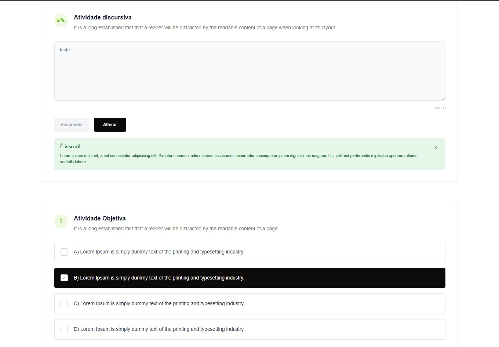
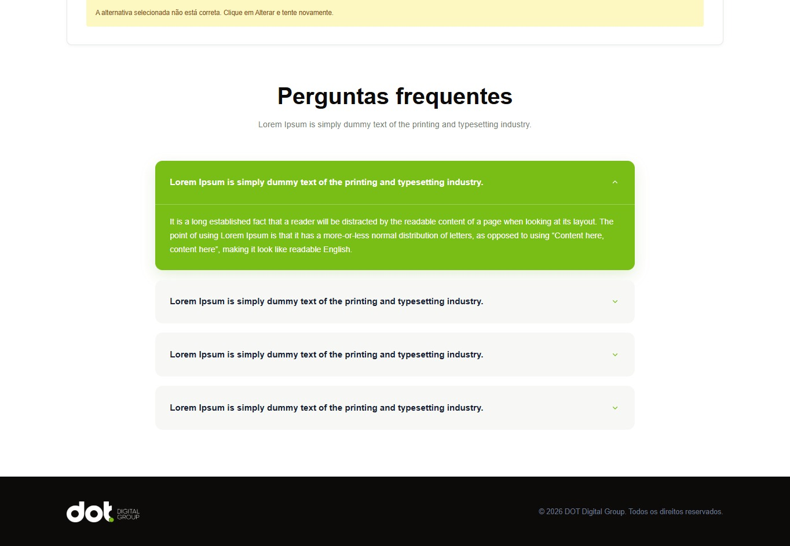
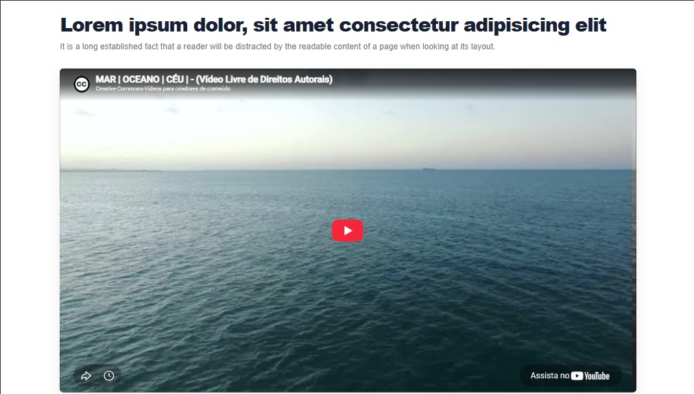
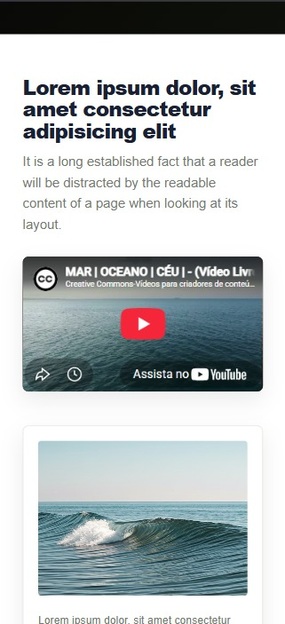

# 🚀 EdTech Landing Page


Uma landing page moderna e responsiva desenvolvida com HTML, CSS e JavaScript puro para demonstrar conceitos de uma plataforma educacional.

---

## 🛠 Tecnologias

- HTML5
- CSS3
- JavaScript (ES6)

---

# 📂 Estrutura do Projeto

```text
📦 assets
 ├── audio/
 ├── icons/
 ├── images/
 └── readme/

📦 css
 ├── components/
 │    ├── accordion.css
 │    ├── activities.css
 │    ├── audio-player.css
 │    ├── browser.css
 │    ├── buttons.css
 │    ├── content-card.css
 │    ├── expandable-cards.css
 │    ├── hero.css
 │    ├── slider.css
 │    └── video-player.css
 │
 ├── base.css
 ├── layout.css
 ├── reset.css
 ├── responsive.css
 ├── style.css
 └── variables.css

📦 js
 ├── components/
 │    ├── accordion.js
 │    ├── audio-player.js
 │    ├── cards.js
 │    ├── discursive-activity.js
 │    ├── objective-activity.js
 │    └── slider.js
 │
 ├── utils/
 │    └── storage.js
 │
 └── main.js
```

---

# 🎨 Organização do CSS

O projeto utiliza uma arquitetura baseada em componentes.

### Estrutura

- **reset.css** → normalização dos estilos
- **variables.css** → variáveis globais
- **base.css** → estilos base
- **layout.css** → containers e estrutura das páginas
- **components/** → estilos isolados por componente
- **responsive.css** → ajustes para diferentes resoluções

---

# ⚙️ Organização do JavaScript

Cada funcionalidade foi separada em módulos independentes.

- Accordion
- Slider
- Player de áudio
- Cards expansíveis
- Atividade discursiva
- Atividade objetiva
- Persistência via Local Storage

Todo o carregamento da aplicação é centralizado em:

```text
main.js
```

---

## 🎯 Funcionalidades

- ✅ Layout totalmente responsivo
- ✅ Hero Section
- ✅ Player de vídeo responsivo
- ✅ Slider de imagens
- ✅ Cards expansíveis
- ✅ Player de áudio customizado
- ✅ Atividade discursiva
- ✅ Quiz de múltipla escolha
- ✅ FAQ Accordion
- ✅ Componentização do CSS
- ✅ JavaScript modular

---

## 🚀 Como executar

Clone o projeto

```bash
git clone https://github.com/alessandrasawczuk/teste-tecnico-frontend-edtech
```

Entre na pasta

```
cd teste-tecnico-frontend-edtech
```

Abra o arquivo `index.html` ou utilize o Live Server.

---

## 📱 Responsividade

O projeto foi desenvolvido seguindo a abordagem **Desktop First**, com breakpoints para tablets e dispositivos móveis.

---

## ♿ Acessibilidade

- Navegação por teclado
- Focus Visible
- HTML semântico
- Estados visuais para interação

---

## 📸 Screenshots

### Hero



### Conteúdo







### Atividades







### FAQ



### Responsividade

| Desktop                           | Mobile                           |
| --------------------------------- | -------------------------------- |
|  |  |

---

## 👩‍💻 Autora

Desenvolvido por **Alessandra Sawczuk**

GitHub: https://github.com/alessandrasawczuk

LinkedIn: https://linkedin.com/in/alessandrasawczuk
